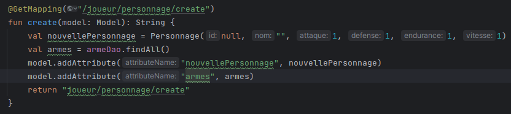
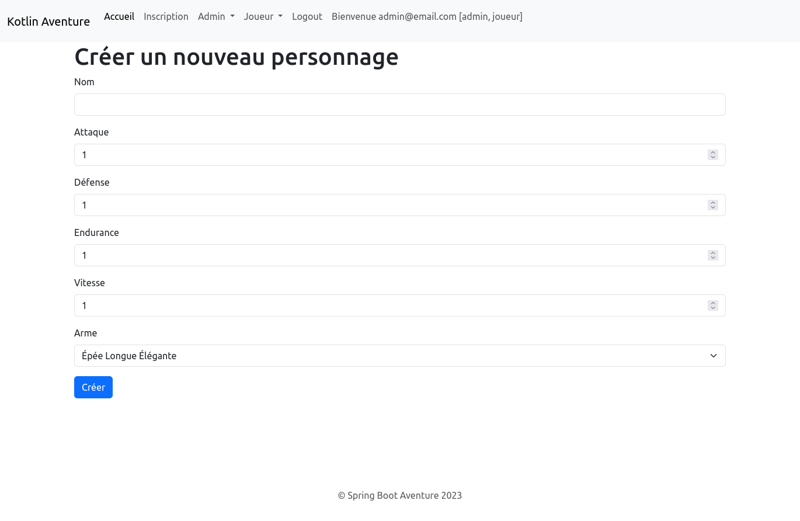
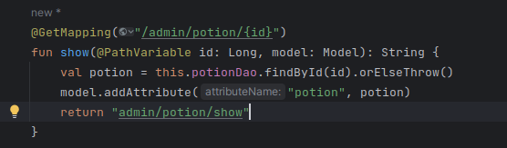
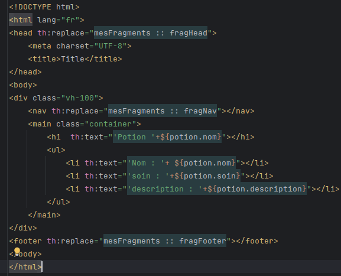
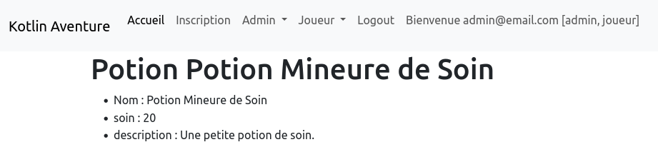
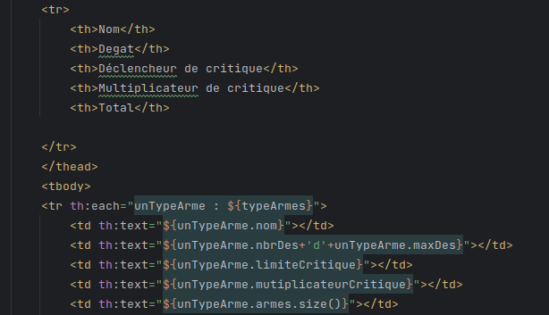
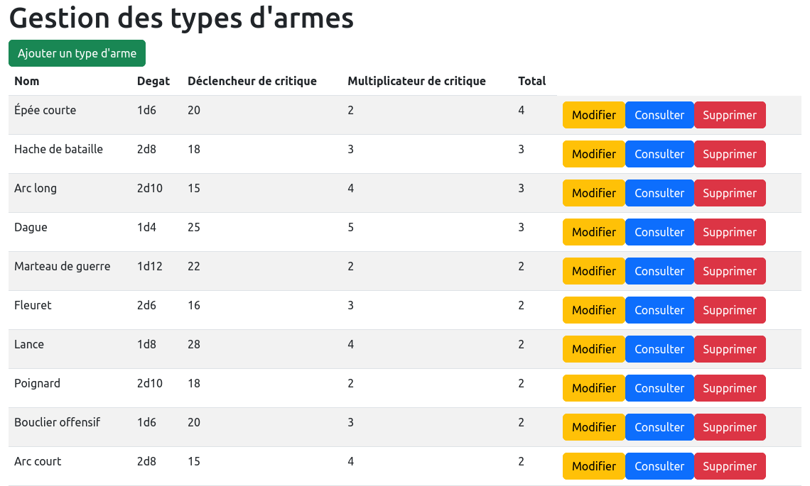

= Compte Rendu : Epreuve E5
:toc-title: Les Missions
:toc: top

Projet réalisé par : *Devamadushan* +
Le 05/12/2023 +

== Mission A
----
Lors de la création d'un personnage (endpoint du formulaire : /joueur/personnage/create), il est nécessaire de permettre au joueur de sélectionner une arme parmi la liste complète des armes.
----

Tout d'abord, pour débuter, j'ai modifié la méthode  *create*
du  *PersonnageControleur* en ajoutant une variable qui contiendra
tous les objets d'armes disponibles et stockés dans la base
de données. +
#_PAGE : (controller/joueur/PersonnageControlleur)_#
[source,kotlin]
----
 val armes = armeDao.findAll()
----
NOTE:: *findAll()* permet de récupérer tous les objets

Deuxièmement, j'ai créé un attribut  *arme*  afin de pouvoir manipuler les objets récupérés dans le modèle (arme/personnage/create).
[source,kotlin]
----
 model.addAttribute("armes", armes)
----

Dernièrement, j'ai modifié le modèle (joueur/personnage/create)
en ajoutant une liste déroulante de tous les objets d'armes récupérés dans l'attribut créé précédemment. +

#PAGE:(templates/joueur/personnage)#
[source,html]
----
 

                <label for="Arme" class="form-label">Arme</label>
                <select class="form-select" id="Arme" th:field="${nouvellePersonnage.armeEquipee.id}" required>
                    <option disabled selected value="">Choisir une arme</option>
                    <option th:each="uneArme : ${arme}" th:value="${uneArme.id}" th:text="${uneArme.nom}"></option>
                </select>
            

----

=== Résultat :

== Mission B
----
Créer la page de consultation pour une potion.
----
Premièrement, pour cette mission, j'ai ajouté une
méthode "show" dans le contrôleur de Potion en créant
une variable "potion" pour stocker un objet potion
appartenant à l'ID que j'ai récupéré en tant que
paramètre. +

#PAGE : (controller/admin/PotionControlleur)#

[source,kotlin]
----
 val potion = this.potionDao.findById(id).orElseThrow()
----
Ensuite, je crée un "model.addAttribute".

[source,kotlin]
----
 model.addAttribute("potion", potion)
----

NOTE:: La méthode *findById(id)* permet d'aller chercher dans la base de données un objet contenant l'ID spécifié en paramètre.

Deuxièmement, j'ai créé un template *show* dans
"admin/potion/", puis j'affiche les données grâce
à "model.addAttribute" qui a été défini dans le
contrôleur. +

#PAGE : (templates/admin/show)#
[source,html]
----
<li th:text="'Nom : '+ ${potion.nom}"></li>
----
NOTE:: `${potion`.nom} correspond au Model que j'ai créé dans le contrôleur et `nom` correspond à l'attribut de la classe Potion.

=== Résultat:

== Mission C
----
Crée une colonne Total pour celles appartenant au type d'arme.
----
Premièrement, j'ai ajouté une colonne  `Total`
et affiché la taille de la liste d'armes appartenant
au *type d'arme*. +

#PAGE : (templates/admin/typeArmure)#

[source,html]
----
<td th:text="${unTypeArme.armes.size()}"></td>
----
NOTE:: `.size()` est utiliser pour trouver la taille de la liste d'armes.

=== Résultat:

